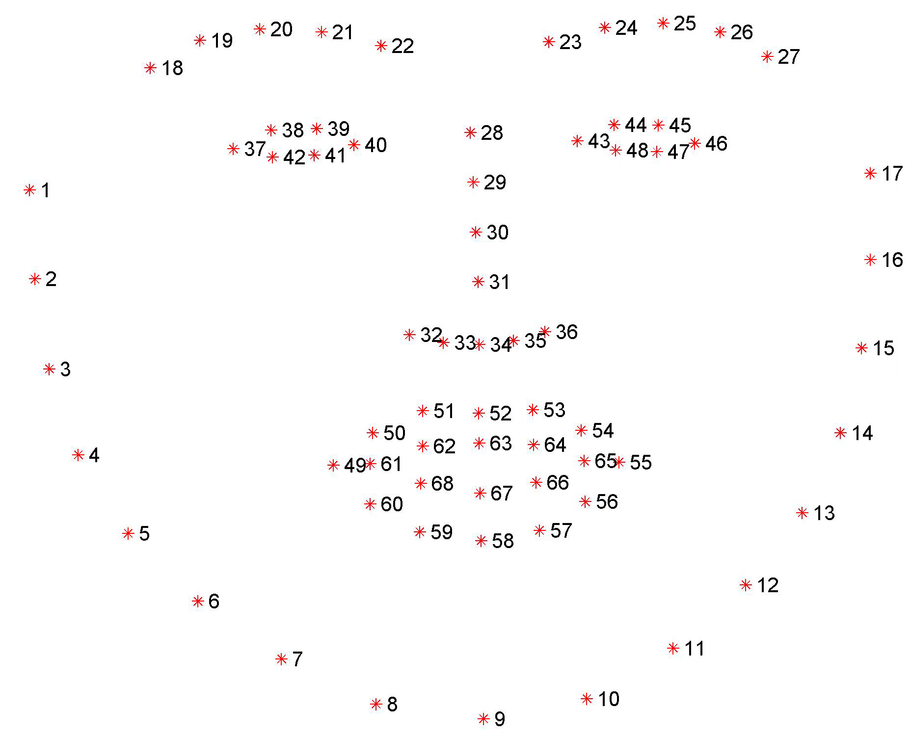

# Face Filters

## Facial Landmark Detection

Detecting facial landmarks using pre-trained model.

## Face Triangulation 

Triangulation of detected face using Delaunay Triangulation method.

## Voronoi Diagram Creation

Creating Voronoi Diagrams using OpenCV module.

## 1+ Faces Support

Triangulation method also supports 1+ faces. Can be slow with more faces.
