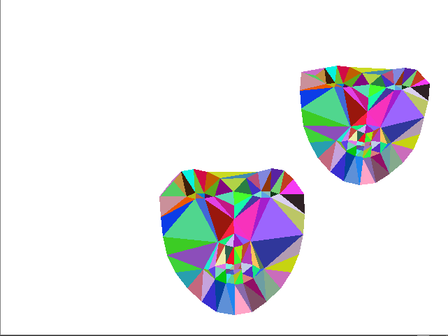

# Face Filters

## Face Triangulation 

Triangulation of detected face using Delaunay Triangulation method.

Creating Voronoi Diagrams using OpenCV module.

Triangulation method also supports 1+ faces. Can be slow with more faces.