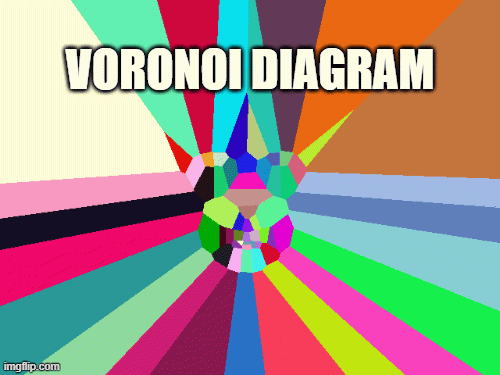

# Face Filters

## Facial Landmark Detection

Detecting facial landmarks using pre-trained model.

## Face Triangulation 

Triangulation of detected face using Delaunay Triangulation method.

## Voronoi Diagram Creation

Creating Voronoi Diagrams using OpenCV module.

## 1+ Faces Support

Triangulation method also supports 1+ faces. Can be slow with more faces.

## Sources
[Facial Landmark Detection Pre-trained Model .dat File](https://github.com/AKSHAYUBHAT/TensorFace/blob/master/openface/models/dlib/shape_predictor_68_face_landmarks.dat)

[Delaunay Triangulation and Voronoi Diagram Tutorial by LearnOpenCV](https://www.learnopencv.com/delaunay-triangulation-and-voronoi-diagram-using-opencv-c-python/)
